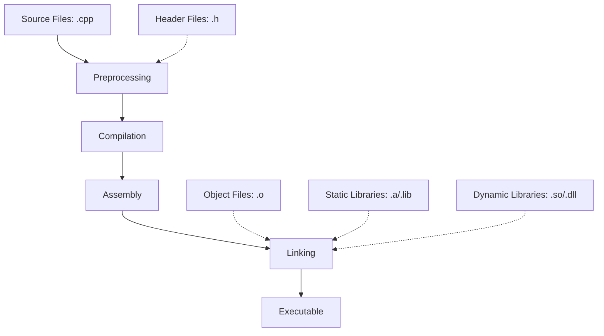

# 🔥 Build Process

Here is a graph of c++ build process:

1. Preprocessing:
   * The preprocessor handles directives like #include, #define, and #ifdef.
   * It expands macros and includes the content of header files.
   * Output: Expanded source code.
   * Generate pre-processed file using: `g++ -E your_file.cpp > preprocessed.cpp`
2. Compilation:
   * The compiler translates the preprocessed code into assembly language.
   * This step includes syntax checking and optimization.
   * Output: Assembly code.
   * Generate Compiled file using: `g++ -S your_code.cpp`
3. Assembly:
   * The assembler converts the assembly code into machine code.
   * Output: Object files (.o or .obj).
4. Linking:
   * The linker combines multiple object files and resolves external references.
   * It incorporates code from libraries (static or dynamic).
   * Output: Executable file or library.

Key points about the build process:

* Each .cpp file is typically compiled separately into an object file.
* The linker brings together all object files and libraries to create the final executable.
* Header files (.h) are not compiled directly but are included in .cpp files.
* Static libraries (.a or .lib) are incorporated directly into the executable.
* Dynamic libraries (.so or .dll) are referenced by the executable but loaded at runtime.

Common build tools:

1. Compilers: GCC, Clang, MSVC
2. Build systems: Make, CMake, Ninja
3. Integrated Development Environments (IDEs): Visual Studio, CLion, Eclipse

Example of a simple build command using GCC:

```sh
g++ -c file1.cpp file2.cpp   # Compile to object files
g++ file1.o file2.o -o myprogram   # Link object files into an executable
```


